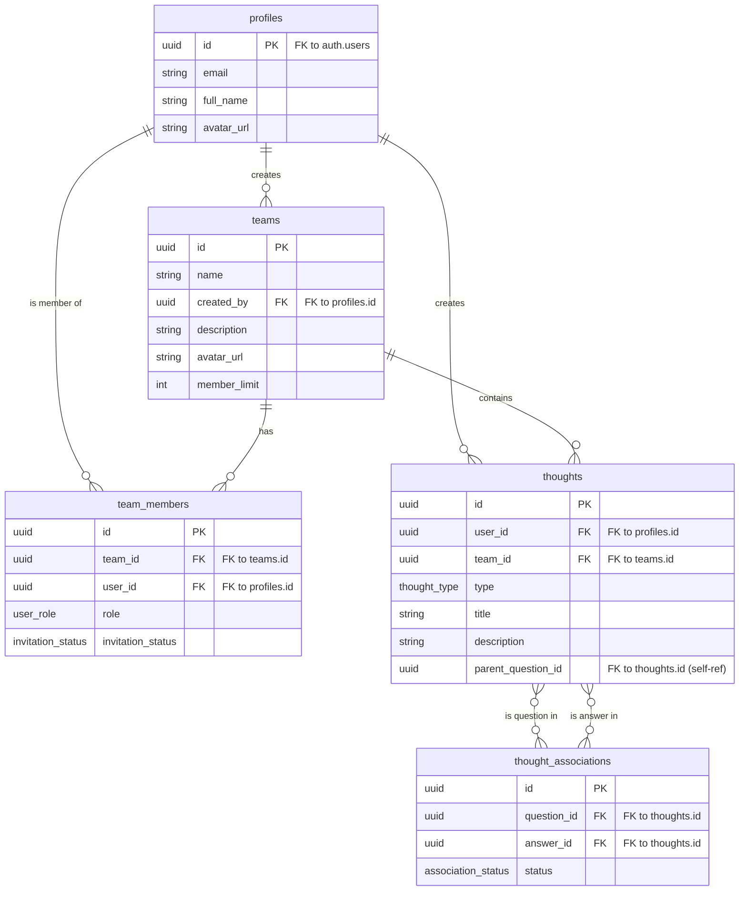
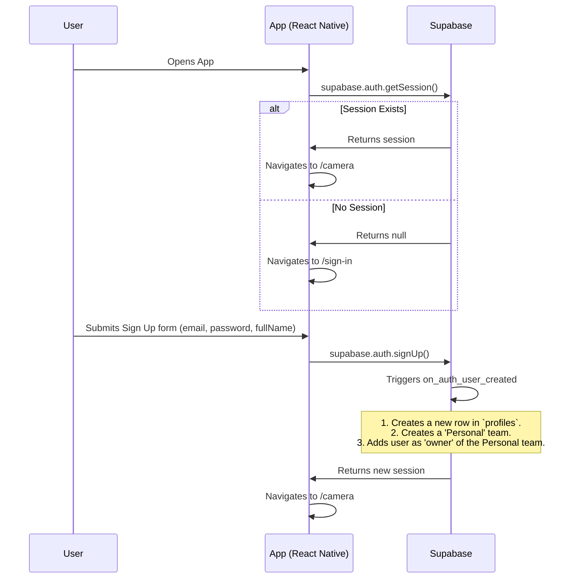

Of course. Here is the comprehensive documentation for the Thought Connect 2 project, designed to provide a deep understanding for future development and refactoring.

## Thought Connect 2: Comprehensive Documentation

### 1\. High-Level Overview

**Thought Connect 2** is a mobile application designed as a collaborative knowledge-sharing platform. The core concept revolves around capturing "thoughts" — which can be questions, answers, or documents — primarily initiated through the device's camera. Users are organized into teams, and these thoughts are shared and managed within the context of those teams.

**The main goals of the project are:**

  * To provide a seamless way for users to capture information visually (via the camera) and textually.
  * To organize knowledge within collaborative spaces (teams).
  * To enable users to ask questions, provide answers, and build a shared knowledge base.
  * To offer a robust and intuitive interface for managing teams, members, and invitations.
  * To secure user and team data effectively using Supabase's Row Level Security.

The application was initially imported from a [Bolt.dev](https://www.google.com/search?q=https://bolt.dev) starter template and has since been built out with a focus on creating a production-ready, feature-rich user experience.

### 2\. Tech Stack

The project is built on a modern React Native stack, leveraging Expo for development and Supabase for the backend.

| Category          | Technology                                                                                                                                                                                           | Purpose                                                                 |
| ----------------- | ---------------------------------------------------------------------------------------------------------------------------------------------------------------------------------------------------- | ----------------------------------------------------------------------- |
| **Core Framework** | [React Native](https://reactnative.dev/) (via [Expo](https://expo.dev/) v53)                                                                                                                        | Cross-platform mobile application development.                          |
| **Backend** | [Supabase](https://supabase.com/)                                                                                                                                                                  | BaaS for database (Postgres), authentication, and storage.              |
| **Routing** | [Expo Router v5](https://docs.expo.dev/router/introduction/)                                                                                                                                         | File-based routing for navigation within the app.                       |
| **UI Components** | [React Native components](https://reactnative.dev/docs/components-and-apis), [Lucide Icons](https://lucide.dev/), [Expo Vector Icons](https://docs.expo.dev/guides/icons/)                          | Building the user interface.                                            |
| **Styling** | [React Native StyleSheet](https://reactnative.dev/docs/stylesheet)                                                                                                                                   | Styling UI components.                                                  |
| **Language** | [TypeScript](https://www.typescriptlang.org/)                                                                                                                                                      | Static typing for improved code quality and developer experience.       |
| **State Management**| React Hooks (`useState`, `useEffect`, `useContext`)                                                                                                                                                  | Managing local and global application state.                            |
| **Fonts** | [@expo-google-fonts/inter](https://github.com/expo/google-fonts)                                                                                                                                     | Using the Inter font family for a clean and modern UI.                  |

### 3\. Directory Structure

The project follows a logical structure that separates concerns, primarily driven by the conventions of Expo Router.

```
.
├── app/                  # Expo Router: All screens and navigation layouts
│   ├── (app)/            # Authenticated user routes (main app)
│   │   ├── (tabs)/       # Layout and screens for the main tab navigator
│   │   └── ...           # Other stack screens (modals, detail views)
│   ├── (auth)/           # Authentication routes (sign-in, sign-up)
│   └── _layout.tsx       # Root layout, providers
├── assets/               # Static assets like images and fonts (not provided)
├── components/           # Reusable UI components
│   ├── team/             # Team-specific components (e.g., TeamCard)
│   └── ui/               # Generic UI components (e.g., Avatar, Badge)
├── hooks/                # Custom React hooks for business logic
├── lib/                  # Library/client initializations (e.g., Supabase)
├── supabase/             # Supabase-specific files
│   └── migrations/       # Database migration scripts
└── types/                # TypeScript type definitions (e.g., database.ts)
```

### 4\. Database Schema

The backend is powered by a PostgreSQL database managed by Supabase. The schema is designed to support users, teams, and the thoughts they create.

**Tables:**

  * **`profiles`**: Stores public user information, linked to the private `auth.users` table.
  * **`teams`**: Represents a workspace or a group of users. Each user has a default 'Personal' team created on sign-up.
  * **`team_members`**: A junction table that links users to teams, defining their role (`owner` or `member`) and invitation status.
  * **`thoughts`**: The central table of the application. It stores questions, answers, and documents, linking them to a user and a team.
  * **`thought_associations`**: Links `thoughts` of type `answer` to `thoughts` of type `question`.

**Entity Relationship Diagram (ERD):**



### 5\. Row Level Security (RLS) and Architecture

A critical aspect of this project is its security model, which underwent a significant refactor to solve a critical issue.

**The Problem: Infinite Recursion**

The initial RLS policies were complex and caused **infinite recursion errors**. This happened because policies on the `team_members` table contained subqueries that referenced the `team_members` table itself, creating a circular dependency.

**The Solution: Simplified, User-Centric RLS**

The problematic policies were dropped and replaced with a much simpler, more performant, and more maintainable model based on the following principles:

1.  **No Circular Dependencies**: No policy references its own table in a subquery.
2.  **Creator/Owner-Based Permissions**: Permissions for managing teams and their members are primarily based on `created_by` in the `teams` table or the `owner` role in the `team_members` table.
3.  **Direct User Access**: Policies grant users access based on a direct match with their own user ID (`auth.uid()`).

**Application-Level Logic**:
To compensate for the simplified database policies, more complex logic for data access (e.g., "fetch all thoughts from all teams a user is a member of") is handled at the application level within the custom hooks (`useTeam`, `useThoughts`). This trades some database-level enforcement for improved reliability and performance, which is a sound architectural choice for this type of application.

The migration files `20250627015905_red_marsh.sql` and `20250627062939_curly_spire.sql` detail the final, simplified policy implementation.

### 6\. Authentication and User Onboarding

The authentication flow is managed by `supabase.auth` and the `useAuth` hook.

**Flow Diagram:**



### 7\. Core Application Logic (Custom Hooks)

The application's state and business logic are cleanly encapsulated in custom hooks.

  * **`useAuth()`**:

      * Manages the user's session and profile data.
      * Provides `signIn`, `signUp`, and `signOut` functions.
      * Listens to `onAuthStateChange` to reactively update the UI.

  * **`useTeam()`**:

      * A comprehensive hook for all team-related state.
      * Fetches all teams the user is a member of (`allTeams`).
      * Manages a list of teams the user has selected for filtering content (`selectedTeams`).
      * Handles team creation, updates, and deletion.
      * Manages team invitations (`pendingInvitations`, `acceptInvitation`, `declineInvitation`).
      * Manages team members (`inviteMembers`, `removeMember`, `transferOwnership`).

  * **`useThoughts()`**:

      * Fetches thoughts based on the currently `selectedTeams` from the `useTeam` hook.
      * Provides a `createThought` function.
      * Includes logic to enrich thought data with author names, team names, and answer counts.

### 8\. Navigation

Navigation is handled by **Expo Router**, which uses a file-based routing system.

**Navigation Diagram:**

```mermaid
graph TD
    A[/] -- No Auth --> B["(auth)/sign-in"]
    A -- Auth --> D["(app)/(tabs)/camera"]

    B --> C["(auth)/sign-up"]
    C --> D

    subgraph Authenticated Routes
        D -- Tab Navigation --> E["(app)/(tabs)/knowledge-base"]
        D -- Tab Navigation --> F["(app)/(tabs)/thoughts"]
        
        D -- Take Picture --> G["(app)/photo-editor"]
        G -- Save Thought --> D

        F -- View Thought --> H["(app)/question-thread/[id]"]
        H -- View Answer --> I["(app)/answer-view/[id]"]
        
        J["(app)/(tabs)/_layout"] -- Has Header --> K["(app)/user-profile"]
        J -- Has Header --> L["(app)/team-filter"]
        K -- Manage Teams --> M["(app)/team-change"]
        M -- View Settings --> N["(app)/team-settings/[id]"]
        L -- Back --> J

    end
```

  * The root layout in `app/_layout.tsx` wraps the entire app in `AuthProvider` and `TeamProvider`.
  * The `app/index.tsx` screen acts as a loading/splash screen that redirects the user based on their authentication status.
  * The `(app)` group is protected and contains all screens accessible after login.
  * The `(tabs)` group defines the main bottom tab navigator.
  * Other screens like `photo-editor` or `team-settings` are pushed onto the navigation stack.

### 9\. UI and Styling

**Theme & Rationale:**
The application uses a clean, modern, and professional design aesthetic.

  * **Color Palette**: A primary color of indigo (`#6366F1`) is used for active states and highlights, creating a vibrant but trustworthy feel. This is complemented by a neutral gray scale for text and backgrounds.
  * **Typography**: The `Inter` font family is used for its excellent readability on screens. A clear typographic hierarchy is established using different font weights (`Regular`, `Medium`, `SemiBold`, `Bold`).
  * **Layout**: The layout is spacious and card-based. Cards use rounded corners, subtle borders, and shadows to create depth and separate content areas. Icons are used effectively to provide visual cues and improve usability.
  * **Styling Implementation**: Styling is done using `StyleSheet.create` from React Native. This is a standard and performant way to define styles, keeping them co-located with their components.

**Reusable UI Components (`/components/ui`):**

  * **`Avatar.tsx`**: Displays a user or team avatar. It can show an image from a URI or fallback to the entity's initials on a colored background. It's highly configurable with different sizes.
  * **`Badge.tsx`**: A small component to display status information (e.g., "Owner", "Pending", "Accepted"). It supports different color variants (`primary`, `success`, `warning`, etc.) and sizes.
  * **`ActionSheet.tsx`**: A modal that slides up from the bottom to present a list of actions to the user (e.g., "Remove Member", "Share").
  * **`ConfirmationDialog.tsx`**: A modal dialog to confirm destructive or important actions (e.g., "Are you sure you want to delete this team?").

### 10\. API and Data Fetching

The application does not have a traditional REST or GraphQL API. Instead, it interacts directly with the Supabase backend using the `supabase-js` client library, which is initialized in `lib/supabase.ts`.

All data fetching and mutations are encapsulated within the custom hooks:

  * `useAuth`: Handles `auth.users` and `profiles` table.
  * `useTeam`: Handles `teams` and `team_members` tables.
  * `useThoughts`: Handles `thoughts` and `thought_associations` tables.

This approach keeps data-fetching logic organized, reusable, and decoupled from the UI components.

-----

This documentation provides a thorough overview of the Thought Connect 2 project. It covers the project's purpose, architecture, and implementation details, which should serve as a solid foundation for any future development or maintenance work.